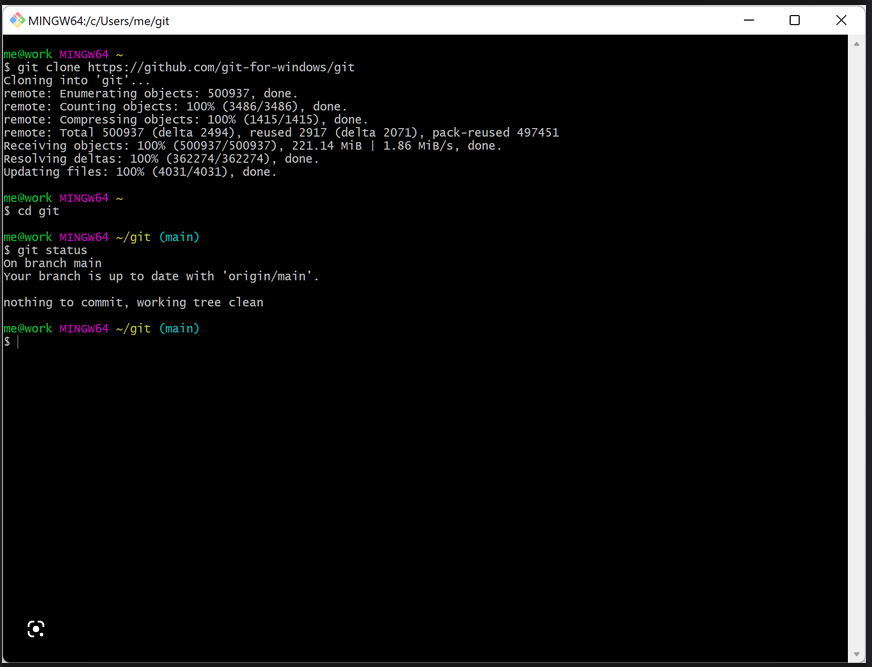
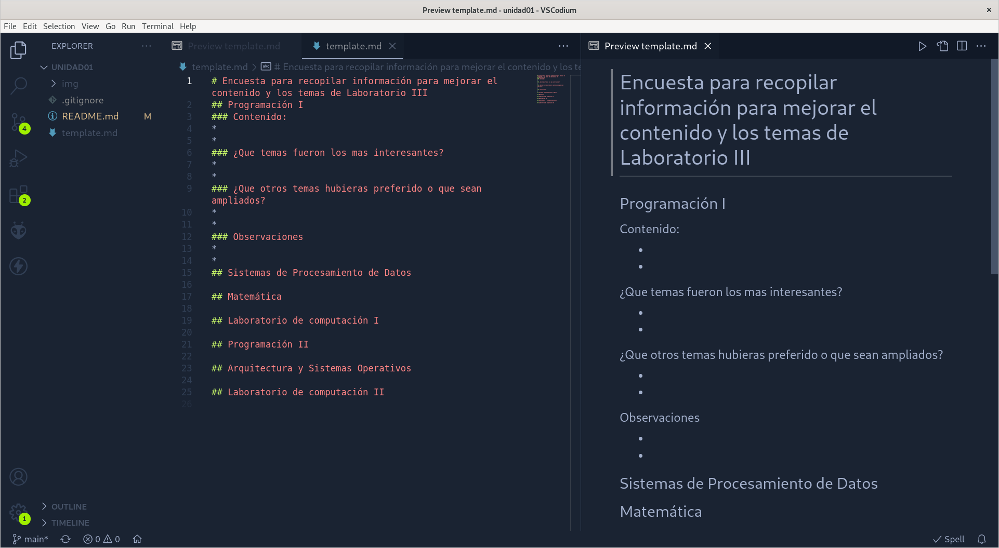
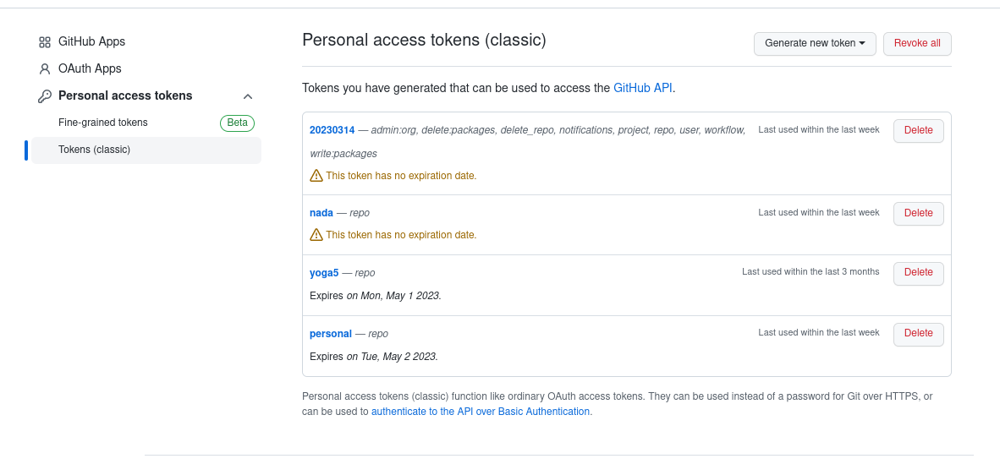

# Unidad 01
# - Introducción a Git
# - Markdown
# <!-- Presentación-->
---
# ¿Que es  Git?

**Es un sistema sofisticado de control de versión distribuido**

*Requerimiento o funcionalidad nueva en un programa y algo deja de funcionar.*

# ¿Como regreso a la version anterior?

`git checkout (etiqueta o hash de version anterior)`

---
# Algunas ventajas de Git
- *Posibilidad de regresar a versiones de un programa.*

- *Ramificar código para dividir el trabajo o para avanzar de forma ordenada*

- *Programar grandes sistemas con equipos de programadores*

- *Trabajar con repositorios de código en la nube (Github, GitLab,Bitbucket)*

- **No confundir Git con los repositorios en la nube**

---
# Instalación


## [Cli](https://git-scm.com/download)
## [Gui](https://git-scm.com/downloads/guis)

---
# 


---
# Clonado de repositorios

Un repositorio e un recurso en la nube donde se aloja código o cualquier tipo de archivo.

No esta limitado a código de programas. 

```bash
    git clone https://github.com/Laboratorio-III/unidad01
```
Luego se creara un directorio con el nombre unidad 1. En donde debemos entrar con el comando  ``` cd unidad01 ```


---
# Setup *user.name* y *user.email*
```
git config --global user.name

git config --global user.name "Tu Nombre"

git config --global user.email

git config --global user.email "tumail@algo.com"

```
---
# Trabajo practico 1

Habiendo clonado el repositorio unida1 de la Organización Laboratorio-III. Deberán tener la siguiente estructura de archivos.

``` shell
img/ README.md template.md
```
Copiar el archivo template.md a otro con su número de legajo con la extension md.
```
cp template.md xxxxxx.md
codium .
```
---



---
# Markdown
## Sub Titulo

Resultado de imagen para markdown
Markdown es un lenguaje de marcado sencillo que sirve para agregar formato, vínculos e imágenes con facilidad al texto simple
```
# Markdown

## Subtítulo

Resultado de imagen para markdown
Markdown es un lenguaje de marcado sencillo que sirve para agregar formato, vínculos e imágenes con facilidad al texto simple
```
---

# Comando **git status**
muestra el estado del directorio de trabajo y del área del entorno de ensayo (staging area)


---
# Comando **git add**

Si todo lo que muestra el comando *git status* esta correcto
```
git add archivo.md 
```


```
git commit -m "Encuesta final y borrado de archivos no usados"
```
---
# GitHub Tokens

En github debemos generar un token para poder subir los archivos agrados o modificado en https://github.com/settings/tokens



---
# Subir los cambios al repositorio.
El parámetro ```fetch``` sincroniza información del repositorio remoto, ```merge``` hace la actualización y luego de haber hecho ```add``` y *commit* sube los cambios a la nube.
```
git fetch 
git merge origin/main #
git push origin main 
```
----
<!-- footer: Markdown -->


# Markdown

## **Es un lenguaje de marcado estilo html pero simplificado para generar documentos de forma rápida y clara.**

---
<!-- header: Encabezados -->
<!-- footer: ""-->

# Titulo 1
## Titulo 2
### Titulo 3
#### Titulo 4
##### Titulo 5
```
# Titulo 1
## Titulo 2
### Titulo 3
#### Titulo 4
##### Titulo 5
```
---

<!-- header: Citas -->
<!-- footer: ""-->
Albert Einstein (Premio Nobel de Física en 1921): 
> solo hay dos cosas infinitas, el universo y la estupidez humana, y no estoy muy seguro de la primera”
```
Albert Einstein (Premio Nobel de Física en 1921): 
> solo hay dos cosas infinitas, el universo y la estupidez humana, y no estoy muy seguro de la primera”
```
---
<!-- header: Listas -->
<!-- footer: ""-->

* C
* C++
* Java
* Python


```
* C
* C++
* Java
* Python
```
---

1. Go
2. Rust
3. Javascript
```
1. Go
2. Rust
3. Javascript

```
---
<!-- header: Code Block -->
<!-- footer: ""-->
```python
for i in range(10):
    print(i)

j = 0
while flag == True:
    if j > 9:
        flag = False
    j += 1

```
\```python
for i in range(10):
print(i)
\```

---
<!-- header: Link -->
<!-- footer: ""-->

Esto es  [un ejemplo](http://example.com/ "Algo que poner") link en linea.

```
Esto es  [un ejemplo](http://example.com/ "Algo que poner") link en linea.

```
---
<!-- header: Énfasis -->
<!-- footer: ""-->


*simple asterisco*

**doble asterisco**

_**Convidados**_


```
*simple asterisco*

**doble asterisco**

_**Convidados**_

```
---
<!-- header: Tablas -->
<!-- footer: ""-->

| Column 1 | Column 2 | Column 3 |
|----------|----------|----------|
| Row 1    | Cell 2   | Cell 3   |
| Row 2    | Cell 5   | Cell 6   |
| Row 3    | Cell 8   | Cell 9   |

```
| Column 1 | Column 2 | Column 3 |
|----------|----------|----------|
| Row 1    | Cell 2   | Cell 3   |
| Row 2    | Cell 5   | Cell 6   |
| Row 3    | Cell 8   | Cell 9   |

```
---
<!-- header: Ecuaciones -->
<!-- footer: ""-->

Cuando $a \ne 0$, hay dos soluciones para $(ax^2 + bx + c = 0)$ y  ellas son: 
$$x = {-b \pm \sqrt{b^2-4ac} \over 2a}$$

```
Cuando $a \ne 0$, hay dos soluciones para $(ax^2 + bx + c = 0)$ y  ellas son: 
$$ x = {-b \pm \sqrt{b^2-4ac} \over 2a} $$


```
---
<!-- header: Practica -->
<!-- footer: ""-->
#### Completar el archivo Markdown con la siguiete tabla 
Valores
1. Fácil
2. Medio
3. Difícil

| Materia| Lenguaje| Dificultad |
| -- | -- | -- |  
| Programación 1| Pseudo Código | 2 |
|Laboratorio 1 |               |
|Programación 2 |               |       |
|           |           |           |


