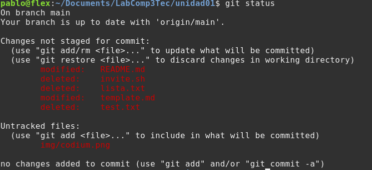

# Unidad 01
# - Introducción a Git
# - Markdown
# <!-- Presentación-->
---
# ¿Que es  Git?

**Es un sistema sofisticado de control de versión distribuido**

*Requerimiento o funcionalidad nueva en un programa y algo deja de funcionar.*

# ¿Como regreso a la version anterior?

`git checkout (etiqueta o hash de version anterior)`

---
# Algunas ventajas de Git
- *Posibilidad de regresar a versiones de un programa.*

- *Ramificar código para dividir el trabajo o para avanzar de forma ordenada*

- *Programar grandes sistemas con equipos de programadores*

- *Trabajar con repositorios de código en la nube (Github, GitLab,Bitbucket)*

- **No confundir Git con los repositorios en la nube**

---
# Instalación


## [Cli](https://git-scm.com/download)
## [Gui](https://git-scm.com/downloads/guis)

---
# 


---
# Clonado de repositorios

Un repositorio e un recurso en la nube donde se aloja código o cualquier tipo de archivo.

No esta limitado a código de programas. 

```bash
    git clone https://github.com/Laboratorio-III/unidad01
```

---
# Setup *user.name* y *user.email*
```
git config --global user.name

git config --global user.name "Tu Nombre"

git config --global user.email

git config --global user.email "tumail@algo.com"

```
---
# Trabajo practico 1

Habiendo clonado el repositorio unida1 de la Organización Laboratorio-III. Deberán tener la siguiente estructura de archivos.

``` shell
img/ README.md template.md
```
Copiar el archivo template.md a otro con su número de legajo con la extension md.
```
cp template.md xxxxxx.md
codium .
```
---


---
# Markdown
## Sub Titulo

Resultado de imagen para markdown
Markdown es un lenguaje de marcado sencillo que sirve para agregar formato, vínculos e imágenes con facilidad al texto simple
```
# Markdown

## Subtítulo

Resultado de imagen para markdown
Markdown es un lenguaje de marcado sencillo que sirve para agregar formato, vínculos e imágenes con facilidad al texto simple
```
---

# Comando **git status**
muestra el estado del directorio de trabajo y del área del entorno de ensayo (staging area)


---
# Comando **git add**

Si todo lo que muestra el comando *git status* esta correcto
```
git add archivo.md 
```


```
git commit -m "Encuesta final y borrado de archivos no usados"
```
---
# GitHub Tokens

En github debemos generar un token para poder subir los archivos agrados o modificado en https://github.com/settings/tokens


---
# Subir los cambios al repositorio.
```
git fetch 
git merge origin/main 
git push origin main 
```
